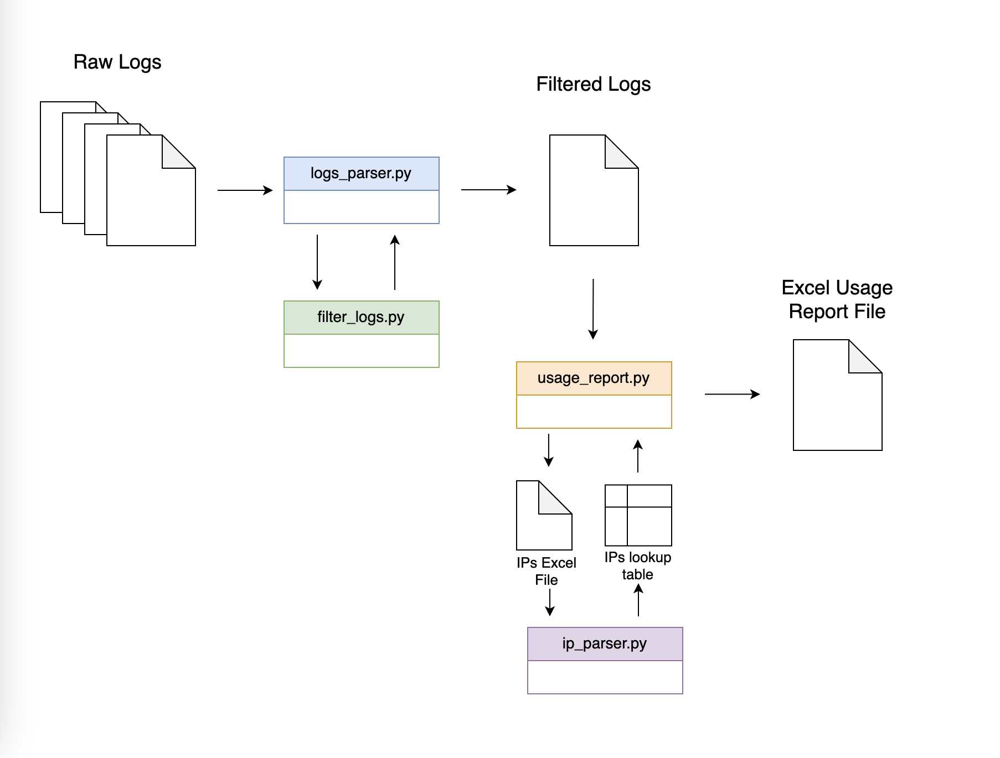

# institutional-usage
Scripts to generate institutional usage statistics for the Canadiana collections. 

- [institutional-usage](#institutional-usage)
  - [Workflow Overview](#workflow-overview)
  - [Getting started](#getting-started)
  - [Usage Overview](#usage-overview)
    - [1. Manual Execution](#1-manual-execution)
      - [Parse Raw Logs](#parse-raw-logs)
      - [Generate the Usage Report](#generate-the-usage-report)
      - [Run IP Address Lookup](#run-ip-address-lookup)
    - [2. Automated Execution](#2-automated-execution)
    - [3. Output](#3-output)
  - [License](#license)

## Workflow Overview
The workflow of the script is illustrated in the diagram below:



1. **Logs Parser** (`logs_parser.py`):
   - The process begins with `logs_parser.py`, which reads raw log files from the server.
   - This script performs a **pre-filtering** step to retain only the logs that correspond to **page views** (i.e., requests containing "/view").
     - Each individual page from a document is counted as a separate view.
   - Any non-relevant logs (e.g., errors, requests other than page views) are excluded.
   - The output of this script is a **filtered log file**, which is a merged collection of all the log files, excluding the irrelevant "trash" lines.

2. **Usage Report Generator** (`usage_report.py`):
   - Once the filtered logs are ready, they are passed to `usage_report.py`.
   - This script reads the filtered logs and generates an **Excel usage report**.
   - To generate the report, you must input an **institution name**.
   - The `usage_report.py` script will then load the **IP lookup table** (using `ip_parser.py`) to identify the IP addresses and proxies associated with the chosen institution.
   - Finally, the script counts the number of matching entries per day from the filtered logs, providing detailed usage data.

## Getting started

1. **Clone the repository**:
   If you haven't already, clone the repository to your local machine:
   ```bash
   git clone <repository-url>
   ```

2. **Set up your environment**:
   - Make a copy of the `.env.sample` file and rename it to `.env`:
     ```bash
     cp .env.sample .env
     ```
   - Open the newly created `.env` file and replace `<your-server-name>` with the appropriate server name.

3. **Install dependencies**:
   - Ensure you have Python installed (recommended version: `Python 3.x`).
   - Install the required dependencies by running:
     ```bash
     pip install -r requirements.txt
     ```
     This will install all necessary Python packages listed in the `requirements.txt` file.

4. **Prepare the required files**:
   - Obtain the latest version of the licensing team's **IP Addresses** excel file and the `institutions.txt` file. Ensure that `institutions.txt` is up to date and matches the list of institutions in the **IP Addresses** excel file.

## Usage Overview

### 1. Manual Execution

Running the scripts individually can be helpful for **debugging purposes** or when you need to test usage data for a **single institution** at a time.

#### Parse Raw Logs

Before generating reports, you need to parse the raw logs by running `logs_parser.py`. This step filters out irrelevant data and creates a log file with only page view requests.

```bash
python logs_parser.py <raw_logs_folder_path>
```
* `<raw_logs_folder_path>`: Path to the folder containing raw log files.
* The resulting filtered log file will be saved as `logs_YYYY-MM-DD.txt` (in the `processed/` directory).
  
#### Generate the Usage Report

Run the `usage_report.py` script to create the Excel usage report based on the filtered logs and 
institution IP addresses.

```bash
python usage_report.py <institution> <logs>
```

* `<institution>`: Name (or abbreviation) of the institution for which to generate the report.
* `<logs>`: Path to the filtered log file (output from `logs_parser.py`)
  
> Note: An abbreviation column is used for institution names based on their email domains (e.g. for University of Toronto, the abbreviation is "utoronto"). This was introduced to avoid Excel's 30-character limit for sheet names.

#### Run IP Address Lookup

`usage_report.py` uses `ip_parser.py` internally to load the IP lookup table. If needed, you can still run `ip_parser.py` manually for testing or data verification.

One way to do that is opening a python terminal, loading the script, and running its functions. For example: 

```python 
from ip_parser import *

# Path to the IP address Excel file
file_path = "institution data file_path"

# Process the IP data (skipping non-header rows)
ips_df = ips_to_df(file_path, 2)

# View the processed data
print(ip_df.head())
```

### 2. Automated Execution
The `run_usage_reports.sh` script automates  the process of generating reports for a list of institutions using a specified filtered log file.

```bash
run_usage_reports.sh <log_file_path>
```
* `<log_file_path>`: Path to a filtered log file generated by logs_parser.py (e.g., `logs_YYYY_MM_DD.txt`).


### 3. Output
* Filtered Logs: Generated by `logs_parser.py` (e.g., `logs_YYYY_MM_DD.txt`).
* Usage Report: Excel report generated by usage_report.py (e.g., `usage-report.xlsx`).
> By default: 
> * Filtered logs are stored in the processed/ folder.
> * Final reports are saved in the reports/ folder.

## License

This project is licensed under the **GNU General Public License v3.0**. See the [LICENSE](LICENSE) file for more details.